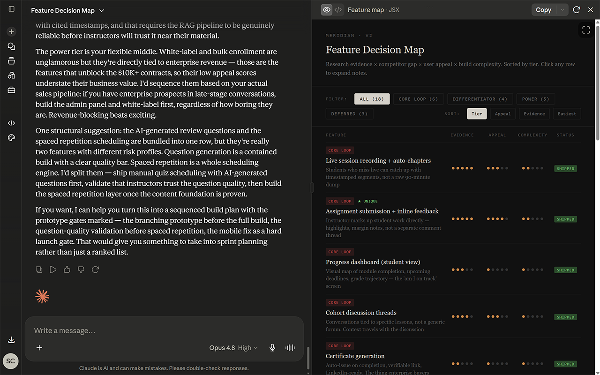
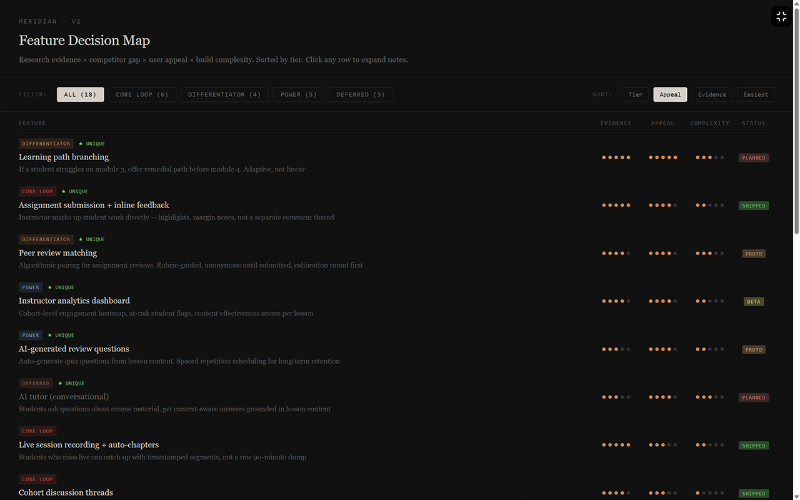

  

  Expand Claude artifacts edge-to-edge. No frame, no clutter. Press Esc to restore.

  <a href="#install">Install</a> · <a href="#how-it-works">How it works</a> · <a href="#privacy">Privacy</a> · <a href="LICENSE">License</a>

---

## Install

**Chrome Web Store** (recommended)

> Coming soon — pending review.

**Manual install**

1. Clone or download this repository
2. Open `chrome://extensions` in Chrome
3. Enable **Developer mode** (top right)
4. Click **Load unpacked** and select this folder

## What it does

A small toggle button appears in the top-right corner whenever a Claude artifact is visible. Click it to expand the artifact to fill your entire browser window. Click again or press **Esc** to restore.

  

  

## How it works

The artifact iframe is styled in place with `position: fixed` and `inset: 0` — it is never moved in the DOM (reparenting an iframe reloads it and destroys the artifact's state). An opaque backdrop behind the iframe prevents the page background from bleeding through.

CSS properties that would break `position: fixed` (transforms, filters, perspective) and properties that create competing stacking contexts (z-index, isolation, opacity) are temporarily neutralized on ancestor elements while maximized, and restored exactly on exit.

## Permissions

This extension requires access to `claude.ai` only. It has no other permissions, no background processes, and makes no network requests.

## Privacy

This extension collects no data. None. See the full [privacy policy](PRIVACY.md).

## Known limitations

- **Web only.** Desktop and mobile Claude apps cannot load Chrome extensions.
- Coupled to one selector: `iframe[src*="claudeusercontent.com"]`. If Anthropic changes the iframe host domain, this will need a one-line update.
- If multiple artifact iframes are visible, the largest one is targeted.

## License

[MIT](LICENSE) — Lucide icons used under [ISC license](https://lucide.dev/license).

---

  Made by <a href="https://github.com/semicognito">semicognito</a>

